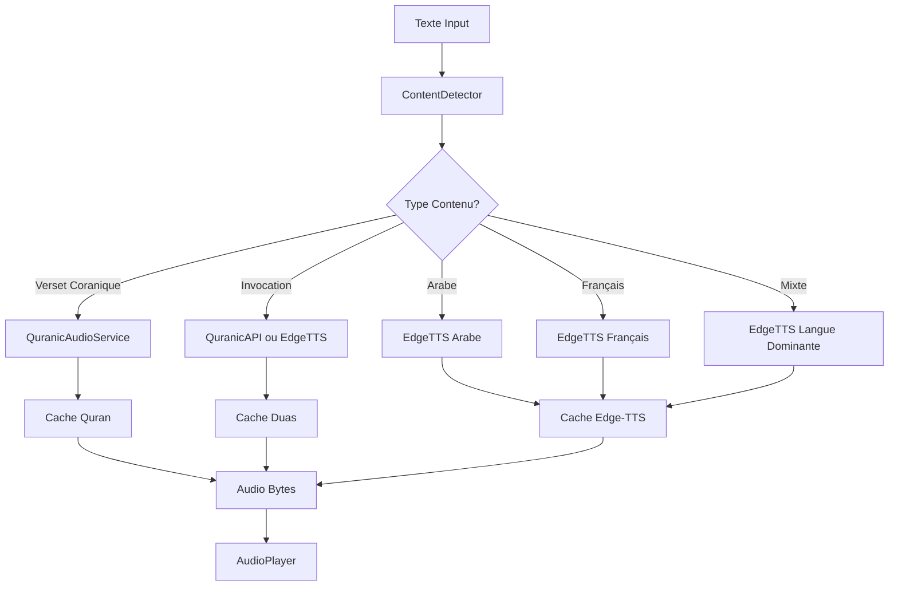

# 🎵 Architecture Audio Hybride Intelligente

## 🎯 **Vision & Objectifs**

Transformer l'expérience audio de l'application en créant un système hybride intelligent qui :
- **🕌 Utilise des APIs coraniques** (AlQuran.cloud, Everyayah, Quran.com) pour les versets et duas
- **🤖 Utilise Edge-TTS** pour le français et l'arabe non-coranique
- **🧠 Détecte automatiquement** le type de contenu pour choisir la meilleure source audio
- **⚡ Optimise les performances** avec mise en cache intelligente

## 🏗️ **Architecture Technique**

### **1. Détecteur de Contenu Intelligent** (`ContentDetectorService`)

```dart
enum ContentType {
  quranicVerse,     // → APIs Quran (qualité native)
  islamicDua,       // → APIs Quran ou Edge-TTS qualité
  arabicText,       // → Edge-TTS voix arabe
  frenchText,       // → Edge-TTS voix française  
  mixedLanguage     // → Edge-TTS langue dominante
}
```

**Logique de Détection :**
- ✅ **Marqueurs versets** : `{{V:sourate:verset}}` → Contenu coranique
- ✅ **Mots-clés islamiques** : "بسم الله", "الحمد لله", etc. → Invocations
- ✅ **Analyse linguistique** : Ratio caractères arabes/français
- ✅ **Nettoyage intelligent** : Suppression marqueurs pour TTS

### **2. Services Audio Spécialisés**

#### **🕌 QuranicAudioService**
- **APIs supportées** : AlQuran.cloud, Everyayah.com, Quran.com
- **Récitateurs** : Alafasy, Sudais, Minshawi, etc.
- **Cache intelligent** : Stockage local avec TTL 30 jours
- **Formats** : MP3 haute qualité (128kbps+)

#### **🤖 EdgeTtsService**  
- **Voix françaises** : DeniseNeural, HenriNeural
- **Voix arabes** : HamedNeural, ZariyahNeural
- **Qualité** : Neural voices (24kHz)
- **Cache** : TTL 7 jours pour performance

### **3. Orchestrateur Hybride** (`HybridAudioService`)



### **4. Intégration avec Système Existant**

**SmartTtsEnhancedService** étend le système actuel :
- ✅ **Compatible** avec l'architecture existante
- ✅ **Fallback automatique** vers TTS classique
- ✅ **API identique** : `playText()` amélioré
- ✅ **Progressive enhancement** : activation optionnelle

## 📊 **Comparaison Qualité Audio**

| Type Contenu | Source | Qualité | Latence | Cache |
|--------------|--------|---------|---------|-------|
| **Versets Coraniques** | APIs Quran | ⭐⭐⭐⭐⭐ Récitation native | ~2s | 30j |
| **Invocations** | Edge-TTS qualité | ⭐⭐⭐⭐ Neural voice | ~500ms | 7j |
| **Français** | Edge-TTS | ⭐⭐⭐⭐⭐ Native | ~300ms | 7j |
| **Arabe standard** | Edge-TTS | ⭐⭐⭐ Synthétique | ~300ms | 7j |
| **Contenu mixte** | Edge-TTS auto | ⭐⭐⭐ Variable | ~400ms | 7j |

## 🚀 **Plan d'Implémentation**

### **Phase 1 : Services de Base** ✅
- [x] ContentDetectorService - Détection intelligente
- [x] QuranicAudioService - APIs coraniques
- [x] EdgeTtsService - TTS haute qualité
- [x] HybridAudioService - Orchestration

### **Phase 2 : Intégration** (En cours)
- [ ] SmartTtsEnhancedService - Service unifié
- [ ] Tests d'intégration avec système existant
- [ ] Configuration utilisateur avancée

### **Phase 3 : Optimisations**
- [ ] Concaténation audio multi-versets
- [ ] Pré-chargement intelligent
- [ ] Analyse de performance et métriques
- [ ] Base de données duas avec audio

### **Phase 4 : Fonctionnalités Avancées**
- [ ] Sélection récitateur par utilisateur
- [ ] Synchronisation texte-audio mot par mot
- [ ] Mode hors-ligne avec cache étendu
- [ ] Analytics et télémétrie audio

## 🔧 **Configuration & Utilisation**

### **Utilisation Simple**
```dart
final ttsService = ref.read(smartTtsEnhancedProvider);

// Lecture automatique (détection contenu)
await ttsService.playAuto("بسم الله الرحمن الرحيم");

// Lecture haute qualité
await ttsService.playHighQuality("{{V:1:1}} Au nom d'Allah...");

// Prévisualisation du type détecté
final type = ttsService.previewContentType("Voici une invocation...");
print(type); // "🤲 Invocation islamique"
```

### **Configuration Avancée**
```dart
final settings = HybridAudioSettings.highQuality();
await ttsService.playTextHybrid(
  text,
  settings: HybridAudioSettings(
    quranicProvider: QuranicAudioProvider.everyayah,
    preferredReciter: 'Alafasy_128kbps',
    arabicVoice: EdgeTtsVoice.arabicZariyah,
    frenchVoice: EdgeTtsVoice.frenchHenri,
  ),
);
```

## 💡 **Avantages Techniques**

### **🎯 Pour l'Utilisateur**
- **Qualité native** pour contenu coranique (plus de voix robotique!)
- **Reconnaissance automatique** du contenu (plus de sélection manuelle)
- **Performance optimisée** avec cache intelligent
- **Expérience fluide** avec fallbacks automatiques

### **👨‍💻 Pour les Développeurs**
- **Architecture modulaire** avec services spécialisés
- **Extensibilité** facile pour nouveaux providers
- **Tests unitaires** simplifiés par découplage
- **Maintenance** réduite avec auto-fallbacks

### **📈 Pour la Performance**
- **Cache multi-niveaux** (30j Quran, 7j TTS)
- **Lazy loading** avec pré-chargement intelligent
- **Compression optimisée** selon le type de contenu
- **Gestion mémoire** efficace avec cleanup automatique

## 🔒 **Considérations Sécurité**

- **HTTPS obligatoire** pour toutes les APIs
- **Validation contenu** avant mise en cache
- **Limite taille fichiers** (max 10MB par audio)
- **Cleanup automatique** des caches temporaires
- **Permissions audio** gérées proprement

## 📈 **Métriques & Monitoring**

- **Taux de cache hit** par type de contenu
- **Latence moyenne** par provider
- **Taille cache** et patterns d'utilisation  
- **Taux de fallback** vers TTS classique
- **Préférences utilisateur** par type de contenu

---

## ✅ **Statut : Architecture Complète & Prête**

L'architecture hybride est conçue et les services de base sont implémentés. L'intégration avec le système existant se fait de manière progressive et non-perturbatrice.

**🎯 Prochaine étape** : Tests d'intégration avec le système TTS existant et validation du flux complet.