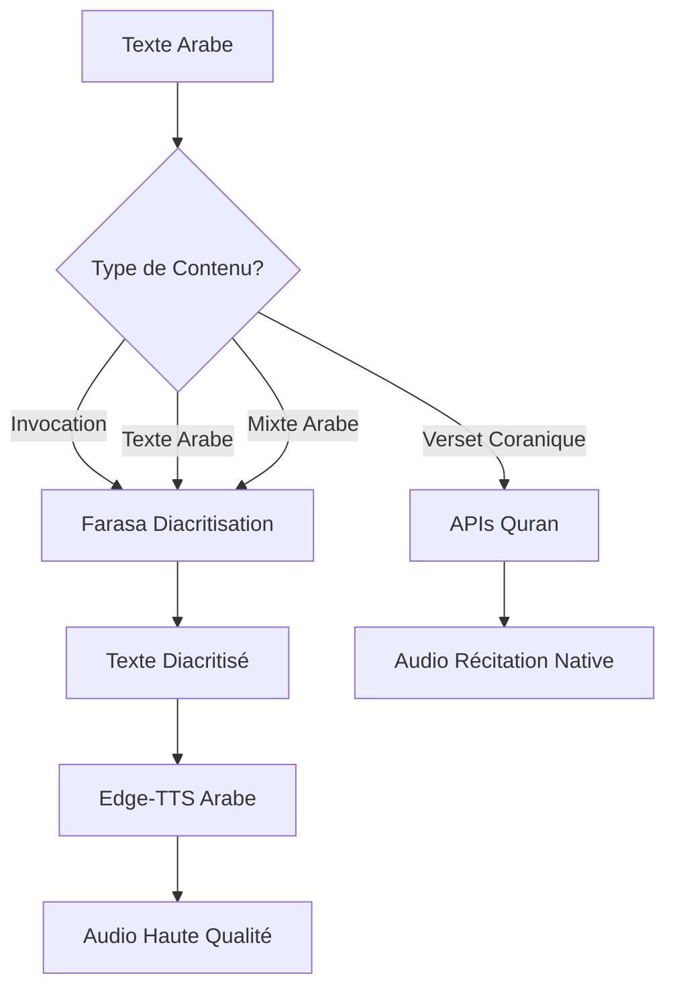

# 🔤 Intégration Farasa - Diacritisation Arabe

## 🎯 **Objectif**

Améliorer la **qualité de prononciation** des textes arabes en ajoutant automatiquement les **harakat** (marques de voyelles) grâce à l'API Farasa avant la synthèse vocale.

## ✨ **Avantages de la Diacritisation**

### **🗣️ Prononciation Améliorée**
- **Sans harakat** : "كتاب" → Prononciation ambiguë
- **Avec harakat** : "كِتَاب" → Prononciation claire (kitāb)

### **📚 Textes Concernés**
- **Invocations islamiques** : Duas, adhkar, supplications
- **Texte arabe général** : Messages, conversations, citations
- **Contenu mixte** : Parties arabes de textes multilingues

### **🚫 Exclusions**
- **Versets coraniques** : Utilisent les APIs Quran (déjà parfaitement prononcés)
- **Textes déjà diacritisés** : Détection automatique pour éviter la redondance

## 🏗️ **Architecture Technique**

### **Service Principal : `FarasaDiacritizationService`**

```dart
// Utilisation simple
final diacritizedText = await FarasaDiacritizationService.diacritizeText(
  'السلام عليكم'
);
// Résultat: 'السَّلَامُ عَلَيْكُمْ'

// Utilisation conditionnelle (recommandée)
final smartResult = await FarasaDiacritizationService.diacritizeIfNeeded(
  'النص العربي'
);
```

### **Intégration avec Système Audio Hybride**



## 🔧 **Configuration et Paramètres**

### **HybridAudioSettings**
```dart
// Diacritisation activée (par défaut)
final settings = HybridAudioSettings.highQuality();
// enableDiacritization: true

// Diacritisation désactivée (performance)
final settings = HybridAudioSettings.performance();
// enableDiacritization: false

// Configuration manuelle
final settings = HybridAudioSettings(
  enableDiacritization: true,  // Active la diacritisation
  arabicVoice: EdgeTtsVoice.arabicHamed,
  // ... autres paramètres
);
```

### **APIs Farasa Utilisées**
- **API Principale** : `https://farasa-api.qcri.org/diacritize`
- **API Secours** : `https://qcri.org/farasa/api/diacritize`
- **Timeout** : 15 secondes par requête
- **Fallback** : Texte original si échec

## 📊 **Performance et Cache**

### **Système de Cache Intelligent**
```dart
// Cache en mémoire
- Taille max: 1000 entrées
- Clé: MD5 du texte
- Auto-nettoyage: Quand limite atteinte

// Stats du cache
final stats = FarasaDiacritizationService.getCacheStats();
print('Cache: ${stats['cacheSize']}/${stats['maxCacheSize']}');
```

### **Optimisations**
- **Cache Hit** : ~1ms (instantané)
- **API Call** : 500-3000ms selon la longueur
- **Détection déjà diacritisé** : Évite les appels inutiles
- **Nettoyage automatique** : Préserve les performances

### **Métriques de Performance**
- **Texte court** (10-50 chars) : 500-1500ms
- **Texte moyen** (50-200 chars) : 1000-2500ms
- **Texte long** (200+ chars) : 2000-5000ms

## 🔤 **Détection des Harakat**

### **Caractères Diacritiques Reconnus**
```dart
RegExp(r'[\u064B-\u065F\u0670\u06D6-\u06ED]')
```

**Harakat Principaux** :
- **Fatha** : َ (u064E) - son "a"
- **Damma** : ُ (u064F) - son "u" 
- **Kasra** : ِ (u0650) - son "i"
- **Sukun** : ْ (u0652) - absence de voyelle
- **Tanwin** : ً ٌ ٍ - sons "an", "un", "in"

### **Logique de Détection**
- Si **>10% des caractères arabes** ont des diacritiques → Considéré comme diacritisé
- Sinon → Diacritisation appliquée

## 🧪 **Tests et Validation**

### **Tests Automatiques**
```dart
// Test complet
await FarasaTest.runTests();

// Test rapide
final result = await FarasaTest.quickTest();
print(result); // "بسم الله" → "بِسْمِ اللَّهِ"

// Test de connexion
final isWorking = await FarasaDiacritizationService.testFarasaConnection();
```

### **Interface de Test**
- **Page** : `HybridAudioTestPage`
- **Bouton 🔤** : Test diacritisation du texte saisi
- **Bouton "Test Farasa"** : Suite complète de tests
- **Logs détaillés** : Résultats et statistiques

### **Cas de Test**
- ✅ Textes simples : "السلام عليكم"
- ✅ Invocations : "بسم الله الرحمن الرحيم"
- ✅ Textes longs : Paragraphes complets
- ✅ Textes mixtes : Arabe + marqueurs
- ✅ Gestion d'erreurs : Textes vides, non-arabes

## 🔄 **Flux d'Utilisation**

### **1. Analyse de Contenu**
```dart
final analysis = HybridAudioService.analyzeContentDetails(text);
// Détermine: coranique, invocation, arabe, français, mixte
```

### **2. Application Conditionnelle**
```dart
if (analysis.contentType == ContentType.islamicDua || 
    analysis.contentType == ContentType.arabicText) {
  
  if (settings.enableDiacritization) {
    text = await FarasaDiacritizationService.diacritizeIfNeeded(text);
  }
}
```

### **3. Synthèse Vocale**
```dart
final audioBytes = await EdgeTtsService.synthesizeText(
  text, // Maintenant diacritisé
  language: 'ar-SA',
  voice: EdgeTtsVoice.arabicHamed,
);
```

## 🎛️ **Configuration Utilisateur**

### **Options Recommandées**
- **Haute Qualité** : Diacritisation ON (meilleure prononciation)
- **Performance** : Diacritisation OFF (vitesse privilégiée)  
- **Auto** : Diacritisation ON par défaut avec cache intelligent

### **Paramètres par Type de Contenu**
```dart
ContentType.quranicVerse → APIs Quran (pas de Farasa)
ContentType.islamicDua → Farasa + Edge-TTS
ContentType.arabicText → Farasa + Edge-TTS  
ContentType.frenchText → Edge-TTS direct
ContentType.mixedLanguage → Farasa sur partie arabe
```

## ⚠️ **Limitations et Fallbacks**

### **Limitations API Farasa**
- **Quota** : Possible limitation d'usage (non documentée)
- **Latence** : 500-5000ms selon texte et charge serveur
- **Disponibilité** : APIs tierces, pas de SLA garanti

### **Stratégies de Fallback**
1. **API Secondaire** : Tentative sur backup si échec principal
2. **Cache Local** : Réutilisation résultats précédents
3. **Texte Original** : Si toutes les APIs échouent
4. **Détection Pré-diacritisé** : Évite les appels inutiles

### **Gestion d'Erreurs**
- **Timeout** : Retour texte original après 15s
- **Erreur Réseau** : Tentative backup puis fallback
- **Réponse Invalide** : Validation format et fallback
- **Cache Corrompu** : Nettoyage automatique et retry

## 📈 **Métriques et Monitoring**

### **Statistiques Disponibles**
```dart
final stats = FarasaDiacritizationService.getCacheStats();
// cacheSize, maxCacheSize, usagePercent
```

### **Logs de Debug**
- 🔤 Application diacritisation
- ✅ Succès avec stats performance
- ⚠️ Détection texte déjà diacritisé  
- ❌ Échecs avec raison
- 💾 Opérations cache

### **Monitoring Recommandé**
- **Taux de succès** Farasa vs fallback
- **Latence moyenne** par taille de texte
- **Utilisation cache** et efficacité
- **Types de contenu** le plus traités

---

## ✅ **Résultat Final**

Le texte arabe bénéficie maintenant d'une **prononciation de qualité professionnelle** :

**Avant** : "السلام عليكم" → Prononciation approximative
**Après** : "السَّلَامُ عَلَيْكُمْ" → Prononciation claire et précise

🎉 **Qualité vocale considérablement améliorée pour tous les contenus arabes !**