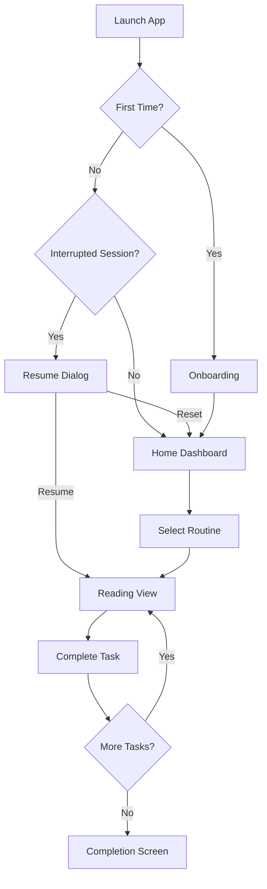

# Product Requirements Document (PRD) pour Développement Assisté par IA
## Application Mobile de Routines Spirituelles - Version Complète

### 🎯 Vision Produit & Objectifs IA

**Mission**: Créer une application mobile spirituelle intelligente avec persistance avancée, catégorisation intuitive et fonctionnalités IA pour accompagner les pratiques religieuses quotidiennes.

**Objectifs de Développement IA**:
1. **Architecture modulaire** auto-générée avec Flutter
2. **Système de persistance** intelligent multi-niveaux
3. **Interface bilingue** RTL/LTR adaptative
4. **IA intégrée** pour suggestions et personnalisation
5. **Mode hors-ligne** complet avec synchronisation

### 🏗️ Architecture Technique pour Développement IA

```yaml
Stack Technologique:
  Frontend:
    - Framework: Flutter 3.x
    - State Management: Riverpod 2.x
    - Navigation: go_router
    - Local DB: Drift (SQL) + Isar (NoSQL)
    - i18n: flutter_localizations + intl
    
  Backend:
    - BaaS: Supabase (PostgreSQL, Auth, Storage, Realtime)
    - Cache: Redis pour sessions
    - Queue: pg_cron pour notifications
    
  Services:
    - TTS: Google Cloud TTS (principal) + Amazon Polly (fallback)
    - Audio: just_audio + audio_service
    - IA: OpenAI GPT-4 / Anthropic Claude API
    - Analytics: Firebase Analytics
    
  DevOps:
    - CI/CD: GitHub Actions
    - Monitoring: Sentry
    - Testing: Flutter Test + Integration Tests
```

### 📦 Modules Fonctionnels Détaillés

#### Module 1: Core Domain & Models
```dart
// Directives IA pour génération
class RoutineTheme {
  final String id;
  final Map<Language, String> name;
  final ThemeFrequency frequency;
  final List<String> routineIds;
  final DateTime createdAt;
  final Map<String, dynamic> metadata;
}

class SpiritualTask {
  final String id;
  final TaskContent content; // Composite pattern
  final TaskCategory category;
  final int defaultRepetitions;
  final Map<Language, Annotations> annotations;
  final AudioSettings audioSettings;
  final DisplaySettings displaySettings;
}

class TaskProgress {
  final String taskId;
  final int remainingRepetitions;
  final Duration elapsedTime;
  final TextPosition currentPosition;
  final DateTime lastUpdate;
  final SessionState state;
}
```

#### Module 2: Système de Persistance Avancé
```dart
// Service IA à générer avec patterns
abstract class PersistenceService {
  // Sauvegarde temps réel
  Stream<void> autoSave(Duration interval);
  
  // État complet de session
  Future<SessionSnapshot> captureSnapshot();
  Future<void> restoreSnapshot(SessionSnapshot snapshot);
  
  // Gestion interruptions
  Future<RecoveryOptions> detectInterruption();
  Future<void> handleRecovery(RecoveryChoice choice);
  
  // Synchronisation cloud
  Future<SyncResult> syncWithCloud();
  Stream<SyncStatus> watchSyncStatus();
}
```

#### Module 3: Système de Catégorisation Intelligent
```dart
// IA génère avec taxonomie
enum TaskCategory {
  louange('Louange', '📿'),
  protection('Protection', '🛡️'),
  pardon('Pardon', '🤲'),
  guidance('Guidance', '🌟'),
  gratitude('Gratitude', '🙏'),
  healing('Guérison', '💚'),
  custom('Personnalisé', '✨');
  
  final String label;
  final String emoji;
  const TaskCategory(this.label, this.emoji);
}

class CategoryFilter {
  List<Task> filterByCategories(List<TaskCategory> categories);
  Map<TaskCategory, List<Task>> groupByCategory();
  List<Task> suggestRelated(Task current);
}
```

#### Module 4: Interface de Lecture Avancée
```dart
// Composants UI IA à générer
class ReadingInterface {
  // Affichage adaptatif
  Widget buildBilingualView(ContentDisplay mode);
  Widget buildTextHighlight(int currentWord, int currentVerse);
  
  // Contrôles interactifs
  Widget buildZoomControls(double min, double max);
  Widget buildFontCustomizer();
  Widget buildFullscreenToggle();
  
  // Synchronisation audio-texte
  Stream<HighlightPosition> syncAudioWithText();
  void adjustReadingSpeed(double factor);
}
```

#### Module 5: Compteur Intelligent & Mode Mains Libres
```dart
class SmartCounter {
  // Logique de décrément
  void decrementWithFeedback(HapticType feedback);
  bool shouldAutoAdvance();
  
  // Mode mains libres
  Stream<CounterEvent> watchHandsFreeMode();
  void configureAutoAdvance(AutoAdvanceSettings settings);
  
  // Persistance
  void saveCounterState();
  CounterState recoverLastState();
}
```

#### Module 6: Système IA Intégré
```dart
class AIService {
  // Suggestions personnalisées
  Future<List<RoutineSuggestion>> suggestRoutines(UserProfile profile);
  
  // Génération de contenu
  Future<GeneratedContent> generateContent({
    required ContentTheme theme,
    required TaskCategory category,
    Language language,
  });
  
  // Traduction et translittération
  Future<Translation> translateContent(String text, Language target);
  Future<Transliteration> transliterate(String arabicText);
  
  // Analyse d'usage
  Future<UsageInsights> analyzeUserPattern();
  Future<OptimizationTips> suggestOptimizations();
}
```

### 🚀 Plan de Développement IA par Phases

#### Phase 1: Foundation (Semaines 1-2)
```bash
# Commandes IA
/build flutter-project spiritual-routines --clean-architecture
/generate models --from-spec
/implement persistence-layer --with-tests
/create database-schema --drift
```

**Livrables IA**:
- ✅ Structure projet avec Clean Architecture
- ✅ Modèles de données avec serialization
- ✅ Couche de persistance avec Drift
- ✅ Tests unitaires (coverage >80%)

#### Phase 2: Core Features (Semaines 3-4)
```bash
# Commandes IA
/implement theme-management --crud
/build task-system --composite-pattern
/create counter-service --persistent
/implement category-filter --smart
```

**Livrables IA**:
- ✅ CRUD thèmes et routines
- ✅ Système de tâches composite
- ✅ Compteur persistant intelligent
- ✅ Filtrage par catégories

#### Phase 3: Advanced UI/UX (Semaines 5-6)
```bash
# Commandes IA
/build bilingual-interface --rtl-support
/implement reading-view --advanced
/create audio-sync --highlight
/build hands-free-mode
```

**Livrables IA**:
- ✅ Interface bilingue RTL/LTR
- ✅ Vue lecture avec zoom/personnalisation
- ✅ Synchronisation audio-texte
- ✅ Mode mains libres complet

#### Phase 4: IA & Services (Semaines 7-8)
```bash
# Commandes IA
/integrate openai-api --suggestions
/implement content-generation
/build translation-service
/create analytics-dashboard
```

**Livrables IA**:
- ✅ Intégration GPT-4/Claude
- ✅ Génération de contenu IA
- ✅ Service de traduction
- ✅ Dashboard analytique

#### Phase 5: Optimisation & Polish (Semaine 9)
```bash
# Commandes IA
/optimize performance --profile
/implement offline-mode --complete
/enhance ux --animations
/finalize testing --e2e
```

### 📋 Spécifications Détaillées pour l'IA

#### Patterns de Code à Implémenter

**1. Repository Pattern avec Cache**
```dart
abstract class TaskRepository {
  Future<Task> getTask(String id);
  Stream<List<Task>> watchTasksByCategory(TaskCategory category);
  Future<void> cacheTask(Task task);
  Future<void> syncWithRemote();
}
```

**2. State Management avec Riverpod**
```dart
@riverpod
class RoutineController extends _$RoutineController {
  @override
  Future<RoutineState> build() async {
    // Auto-generated state management
  }
  
  Future<void> startRoutine(String routineId) async {
    // Implementation
  }
  
  Future<void> pauseAndSave() async {
    // Persist current state
  }
}
```

**3. Service Locator Pattern**
```dart
class ServiceLocator {
  static final _services = <Type, dynamic>{};
  
  static T get<T>() => _services[T] as T;
  static void register<T>(T service) => _services[T] = service;
}
```

### ✅ Critères d'Acceptation Détaillés

#### Fonctionnels
- [ ] Création routine avec catégories multiples
- [ ] Compteur persistant avec reprise exacte
- [ ] Lecture bilingue synchronisée
- [ ] Mode hors-ligne 100% fonctionnel
- [ ] Suggestions IA pertinentes (>70% adoption)
- [ ] Passage auto tâche suivante à zéro

#### Techniques
- [ ] Coverage tests >85%
- [ ] Performance <200ms latence UI
- [ ] Bundle size <35MB
- [ ] Crash rate <0.1%
- [ ] Offline-first architecture
- [ ] RTL/LTR sans bugs visuels

#### UX/UI
- [ ] Onboarding <3 étapes
- [ ] Accessibility score >90
- [ ] Dark mode complet
- [ ] Animations fluides 60fps
- [ ] Responsive design (mobile/tablet)

### 🛡️ Stratégies de Mitigation Avancées

| Risque | Impact | Mitigation IA | Monitoring |
|--------|--------|---------------|------------|
| TTS Arabic quality | Élevé | Multi-provider avec scoring qualité | A/B testing continu |
| Data loss | Critique | Triple backup (local/cloud/export) | Health checks 5min |
| IA latency | Moyen | Cache prédictif + edge functions | P95 < 500ms |
| RTL complexity | Élevé | Directionality widgets + visual tests | Screenshot tests |
| Battery drain | Moyen | Background limits + wake locks | Usage analytics |

### 📊 KPIs & Métriques IA

```yaml
User Engagement:
  - DAU/MAU ratio > 0.6
  - Session duration > 10min
  - Routine completion > 75%
  - Category usage distribution

Technical Performance:
  - App start time < 2s
  - Memory usage < 150MB
  - Network requests cached > 80%
  - Offline availability > 95%

AI Effectiveness:
  - Suggestion acceptance > 40%
  - Content generation satisfaction > 4/5
  - Translation accuracy > 95%
  - Personalization relevance > 70%

Business Metrics:
  - User retention D30 > 50%
  - App store rating > 4.5
  - Support tickets < 1%
  - Churn rate < 10%
```

### 🤖 Instructions Spécifiques pour l'IA

#### Code Generation Guidelines
```bash
1. ALWAYS use null safety and strong typing
2. IMPLEMENT error handling with Result<T> pattern
3. GENERATE comprehensive tests with mocks
4. CREATE documentation inline (français)
5. OPTIMIZE for performance from start
6. DESIGN for offline-first architecture
7. ENSURE RTL/LTR compatibility
8. VALIDATE accessibility standards
9. IMPLEMENT analytics tracking
10. PREPARE for scale (10K+ users)
```

#### Architecture Decisions
- **State**: Immutable state with Riverpod
- **Navigation**: Declarative with go_router
- **Storage**: Drift for structured, Isar for documents
- **Network**: Dio with interceptors
- **Testing**: Unit + Widget + Integration
- **CI/CD**: GitHub Actions with Firebase App Distribution

### 🔄 Workflow Développement IA Optimisé

```bash
# Phase 1: Setup
/analyze requirements --comprehensive
/design architecture --clean
/setup project --flutter-best-practices

# Phase 2: Development
/implement feature --tdd
/test coverage --minimum 85
/review code --quality-gates

# Phase 3: Optimization
/profile performance --production
/optimize bundle --size
/enhance ux --animations

# Phase 4: Deployment
/build release --platforms ios,android
/deploy beta --firebase
/monitor metrics --realtime
```

### 📚 Ressources & Documentation IA

- **API Specs**: OpenAPI 3.0 format
- **Design System**: Material 3 + Custom theme
- **Localization**: ARB files with ICU syntax
- **Error Codes**: Standardized with recovery actions
- **Logging**: Structured JSON with correlation IDs

### 🔧 Configuration Environnement Développement

```yaml
flutter_version: "3.16.0"
dart_version: "3.2.0"
min_sdk:
  android: 21
  ios: 12.0
  
dependencies:
  # Core
  flutter_riverpod: ^2.4.0
  go_router: ^12.0.0
  drift: ^2.13.0
  isar: ^3.1.0
  
  # UI/UX
  flutter_animate: ^4.2.0
  cached_network_image: ^3.3.0
  shimmer: ^3.0.0
  
  # Audio/TTS
  just_audio: ^0.9.35
  audio_service: ^0.18.12
  flutter_tts: ^3.8.3
  
  # Services
  supabase_flutter: ^2.0.0
  dio: ^5.3.3
  firebase_analytics: ^10.7.0
  
  # AI Integration
  http: ^1.1.0
  json_annotation: ^4.8.1
  
dev_dependencies:
  flutter_test: sdk
  mockito: ^5.4.3
  integration_test: sdk
  flutter_lints: ^3.0.0
```

### 📝 Checklist Pré-Développement

- [ ] Environnement Flutter configuré
- [ ] Compte Supabase créé
- [ ] API keys (OpenAI/Claude, Google TTS)
- [ ] Firebase projet setup
- [ ] GitHub repository initialisé
- [ ] Design system défini
- [ ] User stories prioritisées
- [ ] Architecture documentée
- [ ] CI/CD pipeline configuré
- [ ] Monitoring setup

### 🚦 Definition of Done

Une fonctionnalité est considérée comme terminée quand:

1. **Code** ✅
   - Code review approuvé
   - Standards de code respectés
   - Pas de dette technique ajoutée

2. **Tests** ✅
   - Tests unitaires passent
   - Tests d'intégration passent
   - Coverage >85%

3. **Documentation** ✅
   - Code documenté
   - README à jour
   - Changelog maintenu

4. **Performance** ✅
   - Métriques performance OK
   - Pas de memory leaks
   - Bundle size acceptable

5. **Accessibilité** ✅
   - WCAG 2.1 AA compliant
   - Screen reader compatible
   - Keyboard navigation OK

6. **Localization** ✅
   - Textes externalisés
   - RTL/LTR testé
   - Traductions validées

### 📱 Screens & User Flows

#### Écrans Principaux

1. **Splash Screen**
   - Logo animé
   - Chargement des données
   - Vérification mise à jour

2. **Onboarding**
   - Sélection langue
   - Permissions (notifications, audio)
   - Première routine guidée

3. **Home Dashboard**
   - Routines du jour
   - Progression globale
   - Accès rapide catégories

4. **Routine Builder**
   - Sélection thème
   - Ajout tâches
   - Configuration répétitions

5. **Reading View**
   - Affichage bilingue
   - Compteur visible
   - Contrôles audio

6. **Settings**
   - Préférences audio
   - Notifications
   - Backup/Restore

#### User Flows Critiques



### 🎨 Design System Guidelines

#### Couleurs
```css
--primary: #2E7D32 /* Vert spirituel */
--secondary: #FFB300 /* Or */
--background: #FAFAFA
--surface: #FFFFFF
--text-primary: #212121
--text-secondary: #757575
--error: #D32F2F
--success: #388E3C
```

#### Typographie
```css
/* Arabe */
--font-arabic: 'Amiri', 'Scheherazade', serif;
--font-arabic-size: 1.2em;

/* Français */
--font-french: 'Roboto', 'Open Sans', sans-serif;
--font-french-size: 1em;

/* Titres */
--font-heading: 'Montserrat', sans-serif;
```

#### Composants UI
- Material Design 3 guidelines
- Elevation pour hiérarchie
- Animations subtiles (300ms)
- Feedback haptique sur actions

### 🔐 Sécurité & Privacy

#### Données Sensibles
- Chiffrement local (AES-256)
- Pas de données personnelles sans consentement
- Anonymisation des analytics
- RGPD compliant

#### Authentification
- Supabase Auth
- Biométrie optionnelle
- Session timeout configurable
- 2FA disponible

#### Permissions
- Audio: obligatoire pour TTS
- Notifications: optionnelle
- Storage: pour cache offline
- Network: pour sync cloud

### 📈 Stratégie de Lancement

#### Beta Testing
- **Semaine 1-2**: Alpha interne (10 users)
- **Semaine 3-4**: Beta fermée (100 users)
- **Semaine 5-6**: Beta ouverte (1000 users)
- **Semaine 7**: Release candidate

#### Marketing
- Landing page
- App Store Optimization (ASO)
- Social media presence
- Community building

#### Support
- Documentation utilisateur
- FAQ in-app
- Support email
- Feedback système intégré

### 🏁 Conclusion

Ce PRD fournit une base complète pour le développement assisté par IA de l'application de routines spirituelles. Il couvre tous les aspects techniques, fonctionnels et métiers nécessaires pour créer une application de qualité production.

**Prochaines étapes**:
1. Validation du PRD avec stakeholders
2. Setup environnement développement
3. Début Phase 1 (Foundation)
4. Itérations avec feedback utilisateurs

---

*Document version: 1.0*  
*Date: 2024*  
*Auteur: AI Development Team*  
*Contact: [Contact Email]*